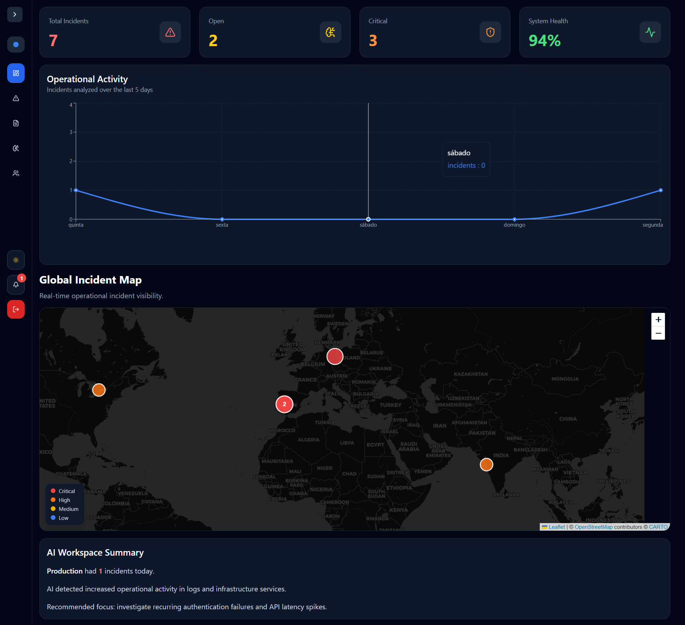
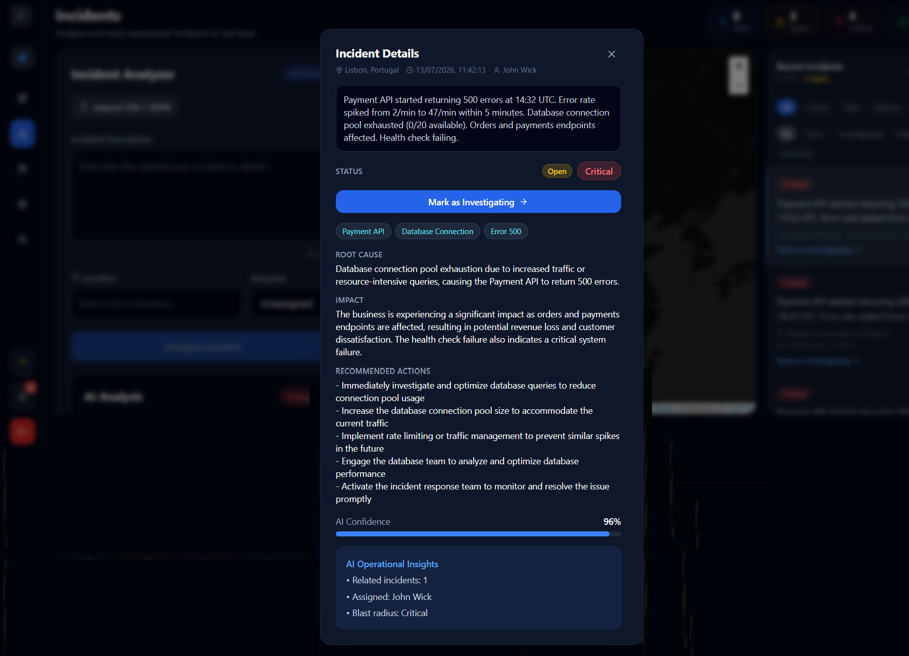
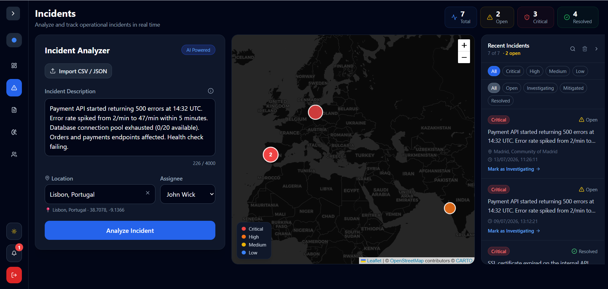
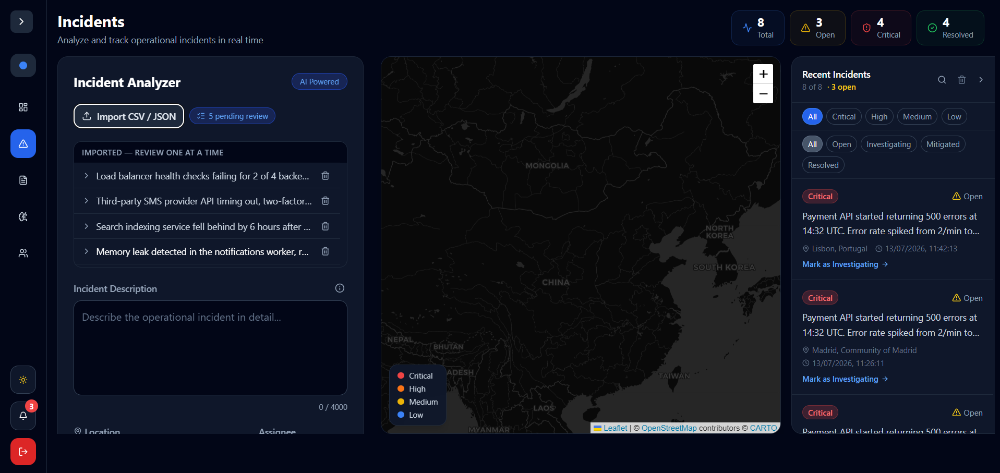

# AI Ops — AI Incident Assistant

An AI-powered IT Operations platform for managing, triaging, and resolving infrastructure incidents. Full-stack: React frontend, FastAPI backend, Postgres, and an LLM-assisted analysis workflow with real-time incident mapping and role-based access control.

**[Live demo →](https://project-dutfp.vercel.app/)**


*Operations dashboard — live incident stats, activity trends, global incident map (Leaflet + CARTO), and AI workspace summary*

## Screenshots

| AI Analysis | Incident Analyzer |
|---|---|
|  |  |
| *LLM root cause analysis with impact assessment, recommended actions, and confidence scoring (Groq, llama-3.3-70b)* | *Describe, geocode, assign, and analyze incidents in real time (Nominatim geocoding)* |


*CSV/JSON bulk import with a review queue before committing incidents*

## Features

- **AI-assisted incident analysis** — powered by Groq's `llama-3.3-70b-versatile` model for fast, intelligent incident summaries and suggestions
- **Interactive incident map** — Leaflet map with severity-colored clusters and theme-aware CARTO tiles
- **Incident lifecycle pipeline** — multi-stage status flow: `Open → Investigating → Mitigated → Resolved`, with optimistic UI updates and automatic rollback on failure
- **Role-based access control** — Admin, Analyst, and Viewer roles with team and assignee management
- **Bulk import** — CSV/JSON file import with a review queue before committing incidents
- **Dark / light theming** — full Tailwind dark mode support across the app, including map tiles
- **Toast notification system** — animated feedback via Framer Motion
- **Rate limiting** — API protection via `slowapi`
- **Geocoding** — location resolution via Nominatim

## Tech Stack

| Layer     | Technology                                            | Hosting  |
| --------- | ----------------------------------------------------- | -------- |
| Frontend  | React + Vite + Tailwind CSS + Framer Motion + Leaflet | Vercel   |
| Backend   | FastAPI + SQLAlchemy 2.0 + slowapi                    | Render   |
| Database  | Supabase (Postgres)                                   | Supabase |
| AI        | Groq API (`llama-3.3-70b-versatile`)                  | —        |
| Geocoding | Nominatim                                             | —        |

## Architecture Highlights

- **Backend-generated UUIDs** for incidents, avoiding client-side ID collisions and validation errors
- **Stale-state-free modals** — React context stores `selectedIncidentId` rather than full incident snapshots, so the UI always reflects the latest data
- **IPv4 connection pooling** — Supabase pooler (port 6543) used to work around Render's IPv6 limitations
- **CI-enforced linting** — ESLint errors block Vercel deploys, catching issues like conditional hook calls before they reach production

## Getting Started

### Prerequisites

- Node.js 18+
- Python 3.11+
- A Supabase project (Postgres)
- A Groq API key

### 1. Clone the repository

```bash
git clone https://github.com/borgasarrifana/AI-Incident-Assistant.git
cd AI-Incident-Assistant
```

### 2. Backend setup

```bash
cd backend
python -m venv venv
source venv/bin/activate     # macOS / Linux
venv\Scripts\activate        # Windows
pip install -r requirements.txt
```

Create a `.env` file in the backend directory:

```
DATABASE_URL=postgresql://<user>:<password>@<host>:6543/postgres
GROQ_API_KEY=your_groq_api_key
```

Run the server:

```bash
uvicorn main:app --reload
```

### 3. Frontend setup

```bash
cd frontend
npm install
```

Create a `.env` file in the frontend directory:

```
VITE_API_URL=http://localhost:8000
```

Run the dev server:

```bash
npm run dev
```

## Deployment

- **Frontend** is deployed on **Vercel** — connect the repo and set `VITE_API_URL` to your Render backend URL in the Vercel dashboard
- **Backend** is deployed on **Render** — set `DATABASE_URL` and `GROQ_API_KEY` in the Render environment settings
- Environment variables must be configured in **both** the local `.env` files and the hosting dashboards

## Roadmap

- [ ] AI Insights screen — deeper cross-incident analytics (in development)
- [ ] Persisted per-incident audit trail
- [ ] Incident detail page (`/incidents/:id`)

## License

This project is open source. Feel free to explore, learn from, and adapt it.

---

Built by [borgasarrifana](https://github.com/borgasarrifana)
